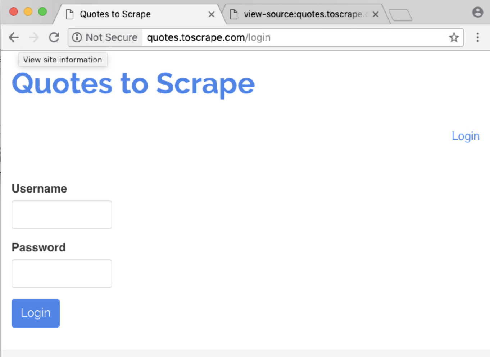
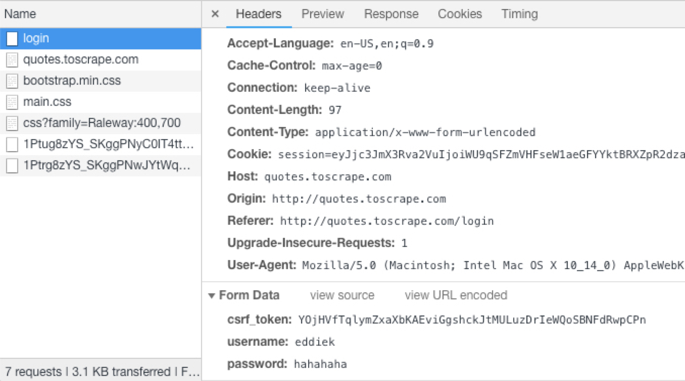
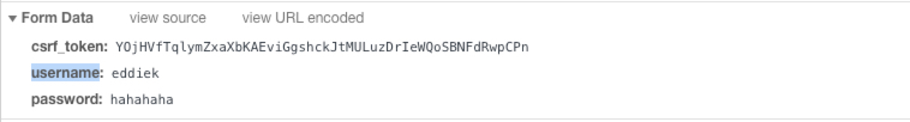
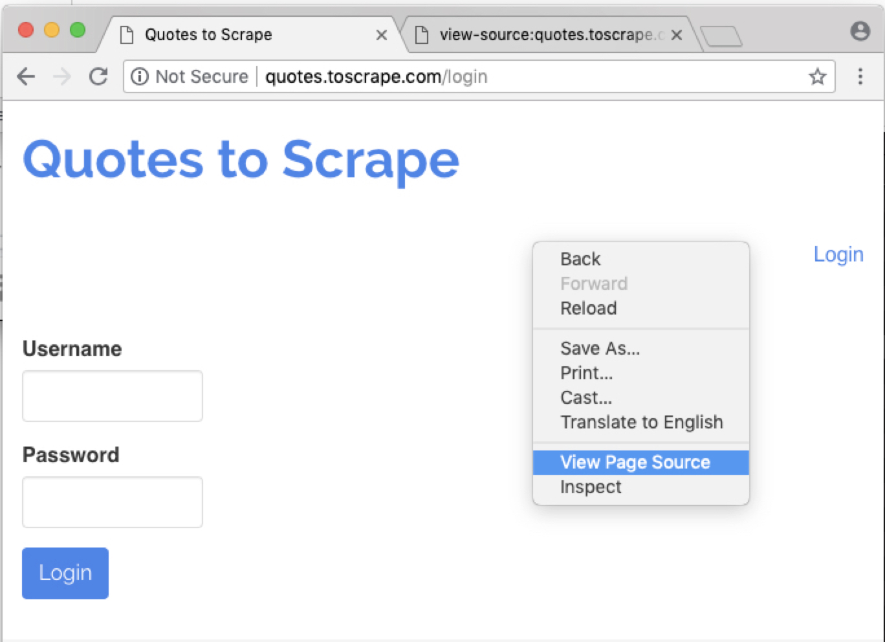
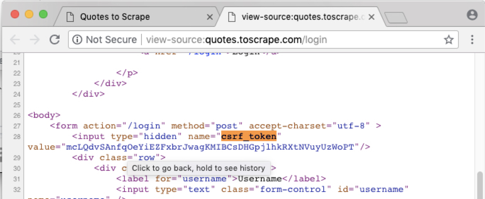

# 10. Logging into Websites Using Scrapy

작업 사이트

소스를 보자

가장 기본 코드

```python
# -*- coding: utf-8 -*-
import scrapy
from scrapy.http import FormRequest

class LoginSpider(scrapy.Spider):
    name = 'login'
    allowed_domains = ['quotes.toscrape.com']
    start_urls = ['http://quotes.toscrape.com/']

    def parse(self, response):
        pass
```


chrome 에서 볼 수 있는 정보들



Form Data 정보



이제 부터 작성할 코드

```python
# -*- coding: utf-8 -*-
import scrapy
from scrapy.http import FormRequest

class LoginSpider(scrapy.Spider):
    name = 'login'
    allowed_domains = ['quotes.toscrape.com']
    start_urls = ['http://quotes.toscrape.com/']

    def parse(self, response):
        csrf_token = response.xpath('...')
        yield FormRequest('http://quotes.toscrape.com/login',
            formdata={  'csrf_token':csrf_token,
                        'username':'eddiek',
                        'password':'hahahaha' },
            callback=self.parse_after_login
            )

    def parse_after_login(self, response):
        pass

```

크롤링실행
```
$ scrapy crawl login
```

또 다른 셸을 띄우고 아래 명령어 처럼 실행해 봅니다.

```
(py27) ~ ❯ scrapy shell 'http://quotes.toscrape.com/login'
```




token정보는 html내용중에 있습니다.



아래 명령어 입력해 봅니다.

```
In [2]: response.xpath('//*[@name="csrf_token"]')
Out[2]: [<Selector xpath='//*[@name="csrf_token"]' data=u'<input type="hidden" name="csrf_token" v'>]
```

토큰을 가져와 봅니다.
```
In [3]: response.xpath('//*[@name="csrf_token"]').extract()
Out[3]: [u'<input type="hidden" name="csrf_token" value="OJwTZqlMvKcGNBhHfRrsLbWmgaUXASpQdEFDIkioVjeyutzxnCPY">']

```
값만 가져옵니다.
```
In [5]: response.xpath('//*[@name="csrf_token"]/@value').extract_first()
Out[5]: u'OJwTZqlMvKcGNBhHfRrsLbWmgaUXASpQdEFDIkioVjeyutzxnCPY'
```

최종 코드는 다음과 같습니다. 로그인 url이 `'http://quotes.toscrape.com/login'`임을 주의하세요.

```python
# -*- coding: utf-8 -*-
import scrapy
from scrapy.http import FormRequest

class LoginSpider(scrapy.Spider):
    name = 'login'
    allowed_domains = ['quotes.toscrape.com']
    start_urls = ['http://quotes.toscrape.com/login']

    def parse(self, response):
        csrf_token =  response.xpath('//*[@name="csrf_token"]/@value').extract_first()
        
        yield FormRequest('http://quotes.toscrape.com/login',
            formdata={'csrf_token':csrf_token,
                      'username':'eddiek',
                      'password':'hahahaha' },
            callback=self.parse_after_login)
              
    def parse_after_login(self, response):
        pass


```

이제 크롤링!
```
(py27) Ξ ~/quotes_login $ scrapy crawl login
```
결과는 다음과 같습니다. 200응답을 받은 후 302로 리다이렉트되고 있는 것이 보입니다.
```
.
.
2018-08-18 11:44:41 [scrapy.core.engine] DEBUG: Crawled (200) <GET http://quotes.toscrape.com/login> (referer: None)
2018-08-18 11:44:42 [scrapy.downloadermiddlewares.redirect] DEBUG: Redirecting (302) to <GET http://quotes.toscrape.com/> from <POST http://quotes.toscrape.com/login>
2018-08-18 11:44:42 [scrapy.core.engine] DEBUG: Crawled (200) <GET http://quotes.toscrape.com/> (referer: http://quotes.toscrape.com/login)
.
.
```

로그인 화면에 성공적으로 진입한 것을 확인하려면 맨 하단 코드를 다음과 같이 변경해봅니다.

```
def parse_after_login(self, response):
        if response.xpath('//a[text()="Logout"]'):
            self.log('You are SUCCESFULLY logged in / 로그인 되었어요~')
        
        pass
```
즉, 로그인 후 HTML 코드에 `Logout`텍스트가 있기 때문에 로그인 성공 여부를 확인할 수 있습니다.
전체 코드는 다음같습니다.
```
# -*- coding: utf-8 -*-
import scrapy
from scrapy.http import FormRequest

class LoginSpider(scrapy.Spider):
    name = 'login'
    allowed_domains = ['quotes.toscrape.com']
    start_urls = ['http://quotes.toscrape.com/login']

    def parse(self, response):
        csrf_token =  response.xpath('//*[@name="csrf_token"]/@value').extract_first()
        
        yield FormRequest('http://quotes.toscrape.com/login',
            formdata={'csrf_token':csrf_token,
                      'username':'eddiek',
                      'password':'hahahaha' },
            callback=self.parse_after_login)
              
    def parse_after_login(self, response):
        if response.xpath('//a[text()="Logout"]'):
            self.log('You are SUCCESFULLY logged in / 로그인 되었어요~')
        
        pass
```

로그인되면 자동으로 브로우져가 실행되게 할 수도 있습니다. `open_in_browser` 를 임포트하고, 맨 아래  `open_in_browser(response)`들 타이핑합니다.
```
from scrapy.utils.response import open_in_browser 
.
.
def parse_after_login(self, response):
        open_in_browser(response)
```
